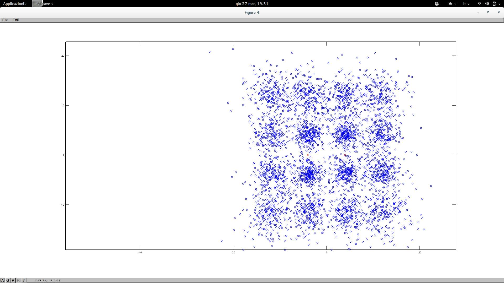

# Acoustic OFDM toy modem

[](https://Ytsejam76.github.io/Acoustic_OFDM/acoustic_ofdm/index.html)

## What this is

This repository is a reconstruction of an older (2014) personal experiment: a short-burst acoustic modem intended for phone-to-phone authentication/data transfer.

The original production target was mobile code (Java on Android, Objective-C on iOS). Octave/Matlab was and still is the exploration environment; Rust is the current implementation path.

## Status

- Octave: main reference implementation, including channel simulation, synchronization experiments, BER/PER sweeps, and plotting.
- Rust (`acoustic_ofdm`): core packet/modulation/demodulation path is ported with tests.
- Rust CLI (`acoustic_ofdm_cli`): test app for WAV encode/decode is available.
- Rust non-oracle sync search is not fully ported yet.

## Links

- OFDM (Wikipedia): https://en.wikipedia.org/wiki/Orthogonal_frequency-division_multiplexing
- OFDM (MathWorks): https://www.mathworks.com/discovery/ofdm.html

## Repository layout

- `octave/`: Octave modem, channel simulation, sweeps, plotting scripts
- `src/`: Rust library (`acoustic_ofdm`)
- `cli/`: Rust CLI crate (`acoustic_ofdm_cli`)
- `images/`: generated plots and figures

## Quick start

### CLI WAV test app

Encode payload to WAV:

```bash
cargo run -p acoustic_ofdm_cli -- encode /tmp/ofdm.wav "hello-ofdm"
```

Decode payload from WAV:

```bash
cargo run -p acoustic_ofdm_cli -- decode /tmp/ofdm.wav
```

Roundtrip (encode + decode):

```bash
cargo run -p acoustic_ofdm_cli -- roundtrip /tmp/ofdm.wav "hello-ofdm"
```

### Octave

Run a channel test:

```bash
octave --quiet --eval "p=struct(); p.pause_before_exit=false; ofdm_test_channel(p);"
```

Run BER/PER sweep plot script:

```bash
octave --quiet run_ber_snr_plot.m
```

### Generate BPSK/QPSK plots

Use the same single script and select modulation with `--mod`:

```bash
# QPSK only
octave --quiet run_ber_snr_plot.m --mod QPSK

# BPSK only
octave --quiet run_ber_snr_plot.m --mod BPSK

# Both (default if --mod is omitted)
octave --quiet run_ber_snr_plot.m --mod both

# Both, with explicit multipath echo profile
octave --quiet run_ber_snr_plot.m --mod both --echo cp_mix

# Both, single plot including all echo profiles (none + room_mild + cp_mix)
octave --quiet run_ber_snr_plot.m --mod both --echo all

# Custom output filename (default is ber_per_snr.png)
octave --quiet run_ber_snr_plot.m --mod both --echo all --output my_experiment.png
```

The script calls `./.venv/bin/python3 plot_snr_sweep_seaborn.py` for final rendering, so set up the venv first.

From repo root:

```bash
python3 -m venv .venv
./.venv/bin/python3 -m pip install --upgrade pip
./.venv/bin/python3 -m pip install numpy scipy matplotlib seaborn
```

Generated files are written to `images/`:

- For any run mode, the final output plot is: `ber_per_snr.png`
- You can override the filename with `--output FILENAME.png`.

## Current modem design (short-burst)

- packetized bursts (not continuous streaming)
- wake preamble for coarse packet detection
- repeated-half sync symbol for timing/coarse CFO
- training OFDM symbol for channel estimation
- BPSK and QPSK
- passband around ~17 kHz in current setup

## Historical note

In 2014, the initial idea used a much more ambitious constellation strategy (16-QAM-style), then shifted pragmatically to 8-FSK for robustness on diverse phones.

This repository is a new attempt focused on making OFDM synchronization and packet handling solid first.



Copyright (c) 2026 Elias S. G. Carotti
