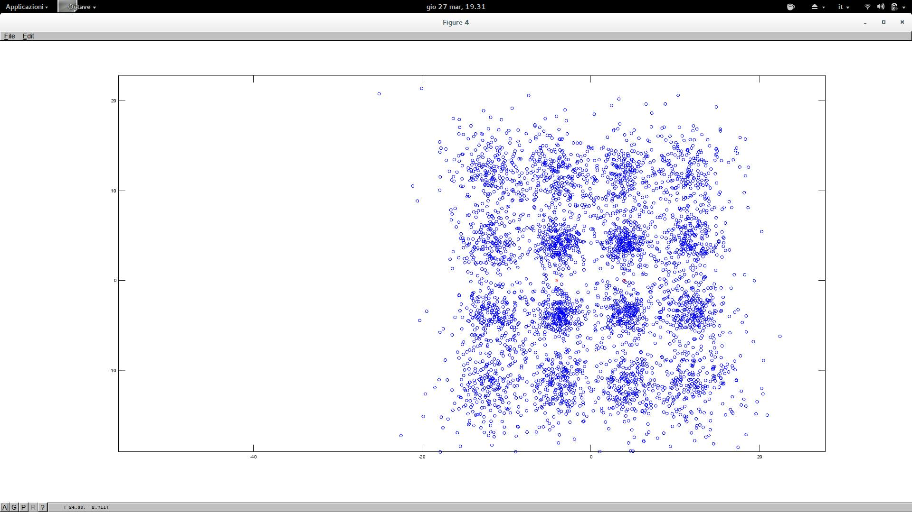

# Acoustic OFDM toy modem

[](https://Ytsejam76.github.io/Acoustic_OFDM/acoustic_ofdm/index.html)

## What this is

This repository is a reconstruction of an older (2014) personal experiment: a short-burst acoustic modem intended for phone-to-phone authentication/data transfer.

The original production target was mobile code (Java on Android, Objective-C on iOS). Octave/Matlab was and still is the exploration environment; Rust is the current implementation path.

I am not an expert in electrical communications, and I am approaching this much more as a learner than as a domain specialist. What keeps me interested is DSP: to me, DSP is real magic, and the mathematical structure behind modulation, synchronization, estimation, and decoding is what makes this fun to explore. 

At the end of the day, this may or may not end up working well as a practical modem, but it is a useful toy project for learning, experimenting, and understanding the pieces better.

## Status

- Octave: main reference implementation for simulations, sweeps, and plots.
- Rust library (`acoustic_ofdm`): baseband and passband single-packet OFDM path, packet build/parse, BPSK/QPSK, pilots, equalization, diagnostics, and oracle round-trip tests are in place.
- Rust CLI (`acoustic_ofdm_cli`): WAV encode/decode, spectrogram export, live `tx`, capture-only `rx`, and coordinated `mic-roundtrip`.
- Passband path can now be selected explicitly:
  - `legacy`: current single-rate passband path
  - `iq`: separate baseband/audio-rate path with resampling
- Current Rust live workflow is decode-first:
  - known scheduled burst times
  - local `sync_off` sweep only
  - no wake/coarse-search focus at this stage
- Current audible setup is working in practice for oracle tests with `mic-roundtrip`; the synchronized TX/RX path decodes repeated bursts and saves debug artifacts.

## Links

- OFDM (Wikipedia): https://en.wikipedia.org/wiki/Orthogonal_frequency-division_multiplexing
- OFDM (MathWorks): https://www.mathworks.com/discovery/ofdm.html

## Repository layout

- `octave/`: Octave modem, channel simulation, sweeps, plotting scripts
- `lib/`: Rust library crate (`acoustic_ofdm`)
- `cli/`: Rust CLI crate (`acoustic_ofdm_cli`)
- `images/`: generated plots and figures

## Quick start

### WAV commands

Encode payload to WAV:

```bash
cargo run -p acoustic_ofdm_cli -- encode /tmp/ofdm.wav "hello-ofdm"
```

Encode payload from stdin to WAV:

```bash
printf "hello-ofdm" | cargo run -p acoustic_ofdm_cli -- encode /tmp/ofdm.wav -
```

Decode payload from WAV:

```bash
cargo run -p acoustic_ofdm_cli -- decode /tmp/ofdm.wav
```

Decode payload from WAV to stdout (raw bytes):

```bash
cargo run -p acoustic_ofdm_cli -- decode --stdout /tmp/ofdm.wav
```

Roundtrip (encode + decode):

```bash
cargo run -p acoustic_ofdm_cli -- roundtrip /tmp/ofdm.wav "hello-ofdm"
```

Roundtrip using stdin payload and stdout decoded bytes:

```bash
printf "hello-ofdm" | cargo run -p acoustic_ofdm_cli -- roundtrip --stdout /tmp/ofdm.wav -
```

Roundtrip with custom OFDM base subcarrier frequency:

```bash
cargo run -p acoustic_ofdm_cli -- roundtrip --base-freq-hz 2000 /tmp/ofdm.wav "hello-ofdm"
```

Generate OFDM body only (no calibration, no wake, no guard):

```bash
cargo run -p acoustic_ofdm_cli -- encode-body /tmp/ofdm_body.wav "hello-ofdm"
```

Generate a spectrogram from a WAV:

```bash
cargo run -p acoustic_ofdm_cli -- spectrogram \
  --in-wav /tmp/ofdm.wav \
  --out-png /tmp/ofdm.png
```

Decode a known window from a WAV:

```bash
cargo run -p acoustic_ofdm_cli -- decode \
  --start-sec 1.20 \
  --window-sec 1.40 \
  --sync-off 0 \
  /tmp/rx_capture.wav
```

Use IQ mode explicitly:

```bash
cargo run -p acoustic_ofdm_cli -- encode \
  --passband-mode iq \
  --fs-baseband 22050 \
  /tmp/ofdm_iq.wav \
  "hello-ofdm"
```

### Live scripts

The repository root contains convenience scripts with current defaults.

There are two families:
- `legacy`: current single-rate working baseline
- `iq`: alternate IQ path with `fs_baseband = 22050`

Transmit repeated BPSK bursts:

```bash
bash tx_simple.sh
```

Transmit repeated BPSK bursts with IQ mode:

```bash
bash tx_iq.sh
```

Transmit repeated QPSK bursts:

```bash
bash tx_qpsk.sh
```

Generate the OFDM body only (first transmission, no wake/calibration):

```bash
bash tx_symbols_only.sh
```

Coordinated speaker/mic roundtrip, BPSK:

```bash
bash rx_decode_simple.sh
```

Coordinated speaker/mic roundtrip, BPSK, IQ mode:

```bash
bash rx_decode_iq.sh
```

Coordinated speaker/mic roundtrip, QPSK:

```bash
bash rx_decode_qpsk.sh
```

Artifacts are written under `output/`, including:

- `tx_packet.wav`
- `tx_symbols_only.wav`
- `tx_roundtrip.wav`
- `rx_capture.wav`
- `rx_spectrogram.png`
- `ofdm_constellation.png`
- `ofdm_constellation_pre_eq.csv`
- `ofdm_constellation_post_eq.csv`
- `ofdm_channel_compare.csv`
- `ofdm_channel_compare.png`

For the current decode-first phase, `mic-roundtrip` is the main live test path.
It uses known scheduled burst times and only searches a small `sync_off` range.

### Script usage

The scripts take no positional parameters. They are meant to be stable presets.

- `tx_simple.sh`
  - legacy passband mode
  - BPSK
  - 8 repeats
  - writes `output/tx.wav`

- `rx_decode_simple.sh`
  - legacy passband mode
  - BPSK
  - one coordinated speaker/mic transmission
  - writes:
    - `output/tx_packet.wav`
    - `output/tx_symbols_only.wav`
    - `output/tx_roundtrip.wav`
    - `output/rx_capture.wav`
    - `output/rx_spectrogram.png`
    - constellation/channel-comparison artifacts
  - log file:
    - `acoustic_ofdm_mic_roundtrip.log`

- `tx_qpsk.sh`
  - legacy passband mode
  - QPSK
  - writes `output/tx_qpsk.wav`

- `rx_decode_qpsk.sh`
  - legacy passband mode
  - QPSK
  - writes QPSK-specific WAVs and spectrogram
  - log file:
    - `acoustic_ofdm_mic_roundtrip_qpsk.log`

- `tx_symbols_only.sh`
  - writes only the OFDM body for one packet
  - no wake, no guard, no calibration
  - useful for listening to the payload itself

- `tx_iq.sh`
  - IQ passband mode
  - `fs_baseband = 22050`
  - BPSK
  - writes `output/tx_iq.wav`

- `rx_decode_iq.sh`
  - IQ passband mode
  - `fs_baseband = 22050`
  - BPSK
  - writes IQ-specific TX/RX WAVs and spectrogram
  - log file:
    - `acoustic_ofdm_mic_roundtrip_iq.log`

Recommended workflow:

1. Start with the working baseline:
   - `bash rx_decode_simple.sh`
2. Compare against QPSK if needed:
   - `bash rx_decode_qpsk.sh`
3. Compare the alternate passband implementation:
   - `bash rx_decode_iq.sh`

That keeps the baseline and the experimental IQ path separate.

### Octave

Run a channel test:

```bash
octave --quiet --eval "p=struct(); p.pause_before_exit=false; ofdm_test_channel(p);"
```

Run BER/PER sweep plot script:

```bash
octave --quiet run_ber_snr_plot.m
```

Tune OFDM base subcarrier frequency (example: 2 kHz):

```bash
octave --quiet --eval "p=struct(); p.base_freq_hz=2000; p.pause_before_exit=false; ofdm_test_channel(p);"
```

### Generate BPSK/QPSK plots

Use the same single script and select modulation with `--mod`:

```bash
# QPSK only
octave --quiet run_ber_snr_plot.m --mod QPSK

# BPSK only
octave --quiet run_ber_snr_plot.m --mod BPSK

# Both (default if --mod is omitted)
octave --quiet run_ber_snr_plot.m --mod both

# Both, with explicit multipath echo profile
octave --quiet run_ber_snr_plot.m --mod both --echo cp_mix

# Both, single plot including all echo profiles (none + room_mild + cp_mix)
octave --quiet run_ber_snr_plot.m --mod both --echo all

# Custom output filename (default is ber_per_snr.png)
octave --quiet run_ber_snr_plot.m --mod both --echo all --output my_experiment.png

# Include oracle curves (optional; default is estimated sync only)
octave --quiet run_ber_snr_plot.m --mod both --with-oracle

# Show script help
octave --quiet run_ber_snr_plot.m --help
```

The script calls `./.venv/bin/python3 plot_snr_sweep_seaborn.py` for final rendering, so set up the venv first.

From repo root:

```bash
python3 -m venv .venv
./.venv/bin/python3 -m pip install --upgrade pip
./.venv/bin/python3 -m pip install numpy scipy matplotlib seaborn
```

Generated files are written to `images/`:

- For any run mode, the final output plot is: `ber_per_snr.png`
- You can override the filename with `--output FILENAME.png`.
- Oracle curves are disabled by default; enable them with `--with-oracle`.
- Constellation comparison is saved as a single image:
  - `constellation_compare.png`
  - For `--mod both --echo all`, layout is `3x2`:
    - rows: `none`, `room_mild`, `cp_mix`
    - columns: `BPSK`, `QPSK`
  - Each panel overlays pre-EQ, post-EQ, and ideal points with legend.
- Time-domain overlays are consolidated into one image per modulation:
  - `time_domain_compare_bpsk.png`
  - `time_domain_compare_qpsk.png`
  - Each image contains one subplot per channel model and overlays TX/RX with legend.

## Current modem design

- packetized bursts, not continuous streaming
- repeated-half sync preamble
- training OFDM symbol for channel estimation
- pilot-assisted equalization
- BPSK and QPSK
- selectable passband path:
  - `legacy`: single-rate
  - `iq`: baseband/audio split with resampling
- current Rust live defaults are fully audible
- configurable OFDM base subcarrier placement via `base_freq_hz`

Current live bring-up intentionally avoids global wake/search complexity.
The priority is:

1. produce a clearly visible/audible transmitted waveform
2. capture it through the speaker/mic path
3. decode it with known burst timing
4. only later reintroduce coarse sync / wake search as separate modem concerns

## Historical note

In 2014, the initial idea used a much more ambitious constellation strategy (16-QAM-style), then shifted pragmatically to 8-FSK for robustness on diverse phones.

This repository is a new attempt focused on making OFDM synchronization and packet handling solid first.



Copyright (c) 2026 Elias S. G. Carotti
